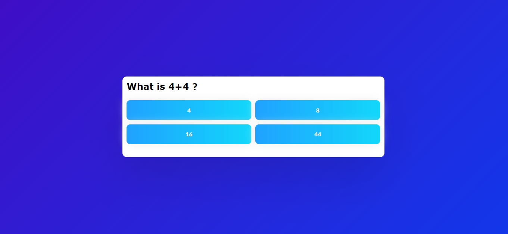
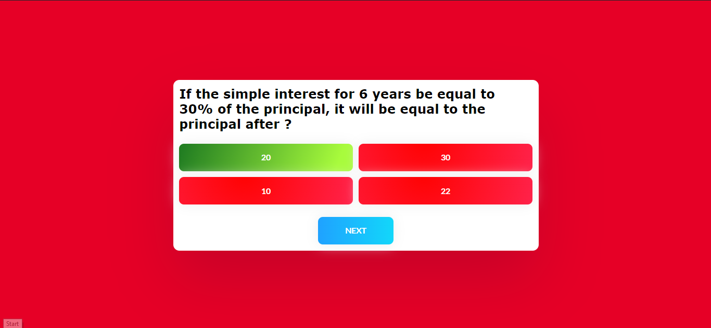

# Quiz App

This is a simple quiz app built using HTML, CSS, and JavaScript. It allows users to answer multiple-choice questions and provides feedback on whether the selected answers are correct or wrong. The app includes a start button, next button, and a set of questions with corresponding answer options.

## Screenshots






## Features

- Start button initiates the quiz.
- Questions are displayed one at a time with multiple-choice answer options.
- Correct and wrong answer feedback is provided.
- Next button allows users to move to the next question.
- At the end of the quiz, users can restart it.

## Technologies Used

- HTML
- CSS
- JavaScript


## Getting Started

To run the quiz app locally, follow these steps:

1. Clone the repository:

    ```bash
    git clone https://github.com/your-username/quiz-app.git
    ```

2. Open the project folder:

    ```bash
    cd quiz-app
    ```

3. Open the `index.html` file in a web browser.

## Quiz Questions

The quiz includes a set of sample questions related to different topics. You can customize the questions by modifying the `questions` array in the `script.js` file.

```javascript
const questions = [
  {
    question: "What is 4+4?",
    answers: [
      { text: "4", correct: false },
      { text: "8", correct: true },
      { text: "16", correct: false },
      { text: "44", correct: false },
    ],
  },
  // Add more questions as needed
];
